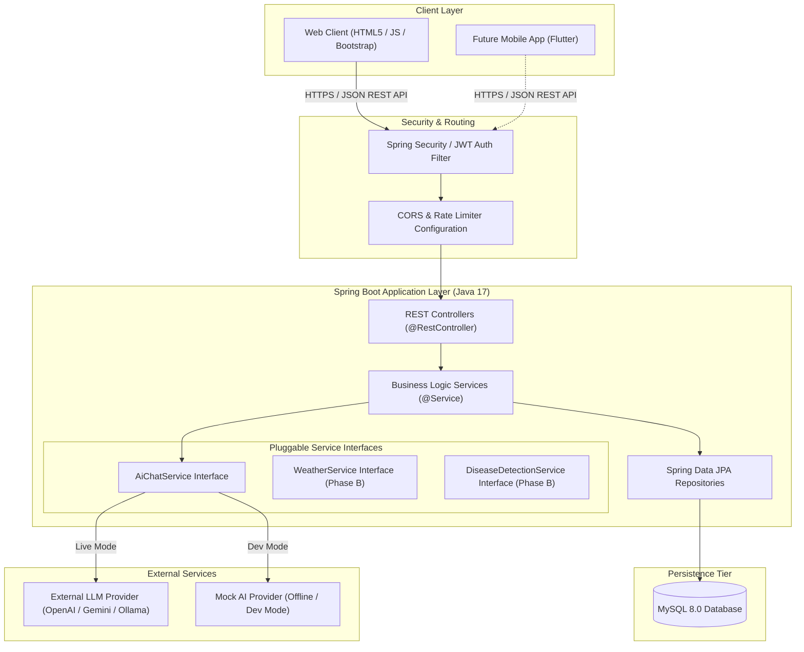
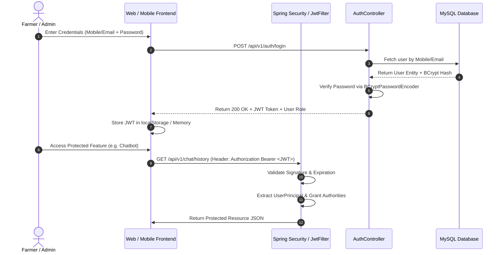
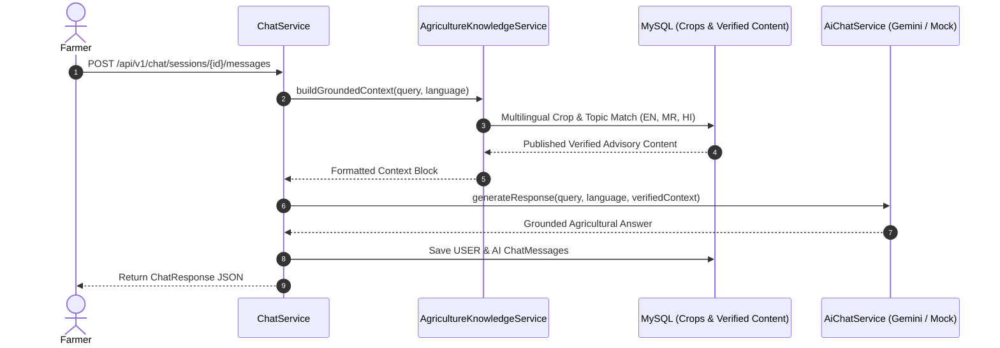

# Smart Krishi Sahayak: System Architecture & Technical Specifications

## 1. High-Level System Architecture

The **Smart Krishi Sahayak** system adopts a decoupled, multi-tier client-server architecture. The backend is designed as a pure **RESTful Web Service**, allowing both the Web Frontend (Phase A) and future Mobile Applications (Phase C - Flutter) to consume the exact same underlying logic, authentication, and database resources.



---

## 2. Layered Architecture & Package Structure

### 2.1 Layer Responsibilities

1. **Controller Layer (`com.smartkrishisahayak.controller`):**
   - Handles incoming HTTP requests (`GET`, `POST`, `PUT`, `DELETE`).
   - Validates input payloads using `@Valid` and Bean Validation annotations.
   - Maps HTTP paths, headers, and query parameters.
   - Returns standard JSON responses using `ResponseEntity<ApiResponse<T>>`.
   - **Strict Rule:** Controllers must NEVER interact with database entities or repositories directly; they communicate solely through Service interfaces and DTOs.

2. **Service Layer (`com.smartkrishisahayak.service`):**
   - Encapsulates core agricultural logic, user management, and AI prompt engineering.
   - Manages transactional boundaries (`@Transactional`).
   - Transforms Entities to DTOs and vice-versa.
   - Interacts with pluggable external service interfaces (`AiChatService`).

3. **Repository Layer (`com.smartkrishisahayak.repository`):**
   - Extends `JpaRepository<Entity, ID>` for database CRUD operations.
   - Defines custom JPQL and native SQL queries for performance-critical lookups (e.g., chat session queries, admin metrics).

4. **Database Tier (MySQL):**
   - Stores normalized tables configured with UTF-8 character encoding (`utf8mb4_unicode_ci`) to natively support Marathi, Hindi, and English script.

---

## 2.2 Complete Backend Package Structure

```
com.smartkrishisahayak
├── SmartKrishiSahayakApplication.java
├── config
│   ├── AppConfig.java                  # General beans (ModelMapper/Jackson)
│   ├── CorsConfig.java                 # Cross-Origin Resource Sharing rules
│   ├── OpenApiConfig.java              # Swagger / OpenAPI documentation setup
│   └── SecurityConfig.java              # Spring Security filter chain setup
├── controller
│   ├── AuthController.java             # Login & Registration endpoints
│   ├── FarmerProfileController.java    # Profile viewing & updates
│   ├── ChatbotController.java          # AI interaction & session management
│   ├── CropController.java             # Crop knowledge retrieval
│   └── AdminController.java            # User monitoring, crop management, analytics
├── dto
│   ├── request
│   │   ├── LoginRequest.java
│   │   ├── RegisterRequest.java
│   │   ├── ChatMessageRequest.java
│   │   ├── CropCreateRequest.java
│   │   └── ProfileUpdateRequest.java
│   └── response
│       ├── ApiResponse.java            # Standard generic API envelope
│       ├── AuthResponse.java           # JWT token & user summary
│       ├── ChatSessionResponse.java
│       ├── ChatMessageResponse.java
│       ├── CropResponse.java
│       └── AdminStatsResponse.java
├── entity
│   ├── User.java                       # Authentication & core user attributes
│   ├── FarmerProfile.java              # Extended farmer demographics
│   ├── Crop.java                       # Verified crop knowledge entity
│   ├── ChatSession.java                # Conversation container
│   ├── ChatMessage.java                # Individual user query & AI answer
│   ├── VerifiedAgricultureContent.java # Curated farm guides
│   └── DiseaseDetectionRecord.java     # Reserved for Phase B
├── exception
│   ├── GlobalExceptionHandler.java    # ControllerAdvice for clean JSON error responses
│   ├── ResourceNotFoundException.java
│   ├── UnauthorizedAccessException.java
│   └── BadRequestException.java
├── repository
│   ├── UserRepository.java
│   ├── FarmerProfileRepository.java
│   ├── CropRepository.java
│   ├── ChatSessionRepository.java
│   ├── ChatMessageRepository.java
│   └── VerifiedContentRepository.java
├── security
│   ├── CustomUserDetailsService.java   # Loads UserDetails from database
│   ├── JwtAuthenticationFilter.java   # Intercepts requests & validates JWT tokens
│   ├── JwtTokenProvider.java          # Generates & parses JWT claims
│   └── UserPrincipal.java             # Authenticated user representation
├── service
│   ├── AuthService.java
│   ├── FarmerProfileService.java
│   ├── ChatService.java
│   ├── AiChatService.java             # Pluggable AI Chatbot Interface
│   ├── AgricultureKnowledgeService.java # Knowledge grounding & retrieval service
│   ├── CropService.java
│   ├── AdminService.java
│   └── impl
│       ├── AuthServiceImpl.java
│       ├── FarmerProfileServiceImpl.java
│       ├── ChatServiceImpl.java
│       ├── AgricultureKnowledgeServiceImpl.java # MySQL-backed deterministic knowledge retrieval
│       ├── MockAiChatServiceImpl.java # Offline / Development AI implementation
│       ├── GeminiAiChatServiceImpl.java # Google Gemini 1.5 Flash grounded implementation
│       ├── CropServiceImpl.java
│       └── AdminServiceImpl.java
└── util
    ├── AppConstants.java               # System-wide constants & enums
    └── LanguageUtils.java              # Helper for language validation
```

---

## 3. Frontend Web Architecture

### 3.1 Static Resource Serving
During Phase A, the web application is served directly via Spring Boot's static resource handler located at `src/main/resources/static/`. This keeps setup straightforward for a 4-member student team while ensuring zero coupling between UI HTML and Java server code.

### 3.2 Directory Structure (`src/main/resources/static/`)
```
static/
├── css/
│   ├── bootstrap.min.css        # Framework styling
│   ├── style.css                # Custom Agriculture Theme & Design Tokens
│   └── dashboard.css            # Sidebar, metrics, and chat layout
├── js/
│   ├── app.js                   # Main application initialization & session check
│   ├── i18n.js                  # Language switcher & dynamic UI translation engine
│   ├── auth.js                  # Login/Register AJAX calls & JWT token storage
│   ├── chat.js                  # Chatbot UI, message rendering, auto-scroll
│   ├── crop.js                  # Crop catalog search & modal viewer
│   ├── admin.js                 # Admin dashboard, user table toggle, crop CRUD
│   └── charts.js                # Chart.js analytics initialization
├── lang/
│   ├── en.json                  # English dictionary
│   ├── mr.json                  # Marathi (मराठी) dictionary
│   └── hi.json                  # Hindi (हिंदी) dictionary
├── assets/
│   ├── images/                  # Banners, icons, placeholders
│   └── favicon.ico
├── index.html                   # Public Landing Page
├── about.html                   # About Project & Team
├── login.html                   # Unified Farmer / Admin Login
├── register.html                # Farmer Registration
├── farmer-dashboard.html        # Farmer Portal Base
├── chatbot.html                 # AI Chatbot Interface
├── crop-info.html               # Verified Crop Catalog
├── profile.html                 # Farmer Profile Management
└── admin-dashboard.html         # Admin Monitoring & Analytics Portal
```

---

## 4. Security & Authentication Strategy

### 4.1 Authentication Choice: JWT (JSON Web Token)
We adopt **Stateless JWT Authentication** over traditional Http Sessions for the following technical reasons:
1. **Future Flutter Mobile App Compatibility:** Mobile apps cannot easily rely on HTTP session cookies. JWT tokens passed in the HTTP `Authorization: Bearer <TOKEN>` header work identically for Web and Flutter applications.
2. **Stateless Scalability:** The backend server does not need to store active session state in RAM or Redis.
3. **Role-Based Access Control (RBAC):** Token payload embeds claims such as `userId`, `role` (`ROLE_FARMER` or `ROLE_ADMIN`), and `preferred_language`.



### 4.2 Password Security
- Passwords are encrypted using **BCrypt** with a default strength factor of 10.
- Raw passwords are never logged, printed, or saved anywhere in the database.

---

## 5. Multilingual Strategy (i18n)

### 5.1 Client-Side UI Translation
- Language files (`en.json`, `mr.json`, `hi.json`) contain key-value mappings for UI labels, headers, and form place-holders.
- `i18n.js` detects user selection, stores preference in `localStorage`, and updates all DOM elements marked with `data-i18n="KEY_NAME"`.

### 5.2 Server-Side & AI Language Alignment
- User entity maintains `preferred_language` (`MR`, `HI`, `EN`).
- When sending queries to the AI Chatbot, the `ChatMessageRequest` contains the `language` parameter.
- The AI prompt builder explicitly instructs the LLM:
  > *"You are an expert agricultural assistant. Respond to the farmer in the following language: {language}. Ensure simple, farmer-friendly terms."*

---

## 6. AI Chatbot Architecture & Knowledge Grounding (Phase 5C & 5D)

### 6.1 Knowledge-Grounded Flow
To ensure factual accuracy and prevent hallucination, the chatbot employs a MySQL-backed knowledge grounding pipeline:



### 6.2 Provider-Independent Interface Pattern
All AI requests pass through the `AiChatService` interface:

```java
public interface AiChatService {
    default String generateResponse(String userQuery, PreferredLanguage language) {
        return generateResponse(userQuery, language, null);
    }
    String generateResponse(String userQuery, PreferredLanguage language, String verifiedContext);
}
```

- **`MockAiChatServiceImpl`:** Development and offline mock returning structured placeholder advisories in EN, MR, and HI.
- **`GeminiAiChatServiceImpl`:** Production AI using Google Gemini 1.5 Flash via REST API with grounded context injection.

### 6.3 Deterministic Knowledge Retrieval Strategy
Rather than requiring complex vector databases or external RAG dependencies at this stage, retrieval is handled deterministically via MySQL:
1. **Query Normalization:** Trims and lowercases farmer input.
2. **Multilingual Crop Detection:** Token and alias matching across English, Marathi, and Hindi names/stems (e.g. `cotton`, `कापूस`, `कापसासाठी`, `कपास`).
3. **Topic & Category Identification:** Maps keywords to categories (`Pest Control`, `Fertilizer Management`, `Sowing & Seed Treatment`, `Irrigation`).
4. **Targeted DB Query:** Fetches records from `verified_agriculture_content` where `is_published = true`.
5. **Language Prioritization & Fallback:** Prioritizes articles in the farmer's requested language. If unavailable, falls back to available language records (e.g. English) which Gemini translates and explains in the requested language.
6. **Prompt Assembly:** Injects compact, structured verified facts before the farmer's query.

### 6.4 Prompt Engineering & Safety Guardrails
1. **Authoritative Grounding:** Gemini is strictly instructed to prefer the provided verified agriculture context as the primary source of truth.
2. **No Hallucination Rule:** Do not contradict the verified knowledge context or invent unverified chemical dosages.
3. **No-Knowledge Disclaimer:** If no verified records exist for the query, the AI must explicitly state that the verified knowledge base does not contain specific records for the request, provide only safe general agricultural principles if applicable, and recommend consulting a local Krishi Seva Kendra or agriculture officer.
4. **Mandatory Language Enforcement:** Enforces exact script and language matching (`MR` in Devanagari, `HI` in Devanagari, `EN` in English).

---

## 7. Plant Disease Detection Architecture Analysis (Phase B Preparation)

For Phase B, leaf-image disease diagnosis will be required. We evaluated four potential architectural integration paths:

| Integration Option | Complexity | Performance | Recommendation for 2nd Year CSE Team |
|---|---|---|---|
| **1. Deep Java Library (DJL) / TensorFlow Java** | High | Medium | ❌ Complex native C++ JNI dependencies; hard to debug build failures. |
| **2. ONNX Runtime Java** | Medium | High | ⚠️ Good, but requires converting PyTorch/TF models to `.onnx` format. |
| **3. Python FastAPI Microservice** | Low-Medium | High | ✅ **RECOMMENDED:** PyTorch/TensorFlow models run natively in Python. Spring Boot sends image via HTTP multipart POST to `http://localhost:8000/predict`. |
| **4. External Cloud Vision API** | Low | High | 💰 Simple, but requires external cloud subscription costs. |

**Decision:** If implemented in Phase B, Option 3 (Python FastAPI Microservice) or Option 4 will be used, keeping Spring Boot clean while isolating ML execution.

---

## 8. Technical Risks & Mitigation Strategies

| Risk | Potential Impact | Mitigation Strategy |
|---|---|---|
| **LLM API Rate Limits / Failure** | Chatbot fails or hangs UI. | Implement fallback to `MockAiChatServiceImpl` with retry policies and short HTTP timeouts (5s). |
| **Exposure of API Keys** | Security breach / financial loss. | Keep secrets out of code. Use `.env` and `System.getenv("AI_API_KEY")`. Add `.env` to `.gitignore`. |
| **Non-UTF8 Database Encoding** | Marathi / Hindi characters corrupt into `???`. | Force database connection URL parameter: `jdbc:mysql://localhost:3306/krishi_db?useUnicode=true&characterEncoding=UTF-8`. |
| **CORS Errors with Mobile App** | Mobile client blocked by backend. | Configure global `CorsConfig` in Spring Security to allow cross-origin headers during development. |
