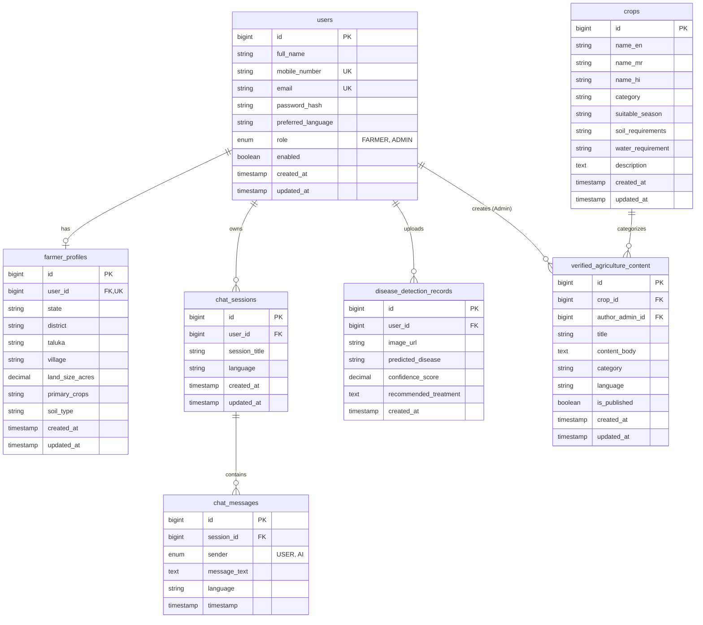

# Smart Krishi Sahayak: Database Design & Schema Specifications

## 1. Database Overview & Principles

The **Smart Krishi Sahayak** system uses **MySQL 8.0** relational database management system. 

### 1.1 Key Design Principles
1. **Third Normal Form (3NF):** Schema is normalized to minimize redundancy and maintain data integrity.
2. **Unified User Authentication:** A single `users` table handles both `FARMER` and `ADMIN` credentials, avoiding duplicated auth logic.
3. **Native Multilingual (UTF-8) Support:** All text fields use `utf8mb4` character set and `utf8mb4_unicode_ci` collation to support Marathi (Devanagari), Hindi, and English characters without truncation or corruption.
4. **Audit Fields:** Every entity table includes standardized `created_at` and `updated_at` timestamps managed automatically by JPA `@CreationTimestamp` and `@UpdateTimestamp`.
5. **Cascading Integrity:** Foreign keys enforce strict referential integrity (e.g. deleting a chat session cascades to its messages).

---

## 2. Entity Relationship (ER) Diagram



---

## 3. Detailed Table Specifications

### 3.1 `users` Table
Stores account login credentials and system roles for both farmers and administrators.

| Column Name | Data Type | Constraints | Description |
|---|---|---|---|
| `id` | `BIGINT` | `PRIMARY KEY`, `AUTO_INCREMENT` | Unique user ID |
| `full_name` | `VARCHAR(100)` | `NOT NULL` | User's full name |
| `mobile_number` | `VARCHAR(15)` | `NOT NULL`, `UNIQUE` | 10-digit mobile number for login |
| `email` | `VARCHAR(100)` | `NULLABLE`, `UNIQUE` | Optional email address |
| `password_hash` | `VARCHAR(255)` | `NOT NULL` | BCrypt encrypted password hash |
| `preferred_language` | `VARCHAR(10)` | `NOT NULL`, `DEFAULT 'MR'` | `EN`, `MR`, or `HI` |
| `role` | `VARCHAR(20)` | `NOT NULL`, `DEFAULT 'FARMER'` | `ROLE_FARMER` or `ROLE_ADMIN` |
| `enabled` | `BOOLEAN` | `NOT NULL`, `DEFAULT TRUE` | Account active/disabled flag |
| `created_at` | `DATETIME` | `NOT NULL` | Account registration timestamp |
| `updated_at` | `DATETIME` | `NOT NULL` | Last profile update timestamp |

**Indexes:**
- `idx_users_mobile` ON `mobile_number`
- `idx_users_email` ON `email`

---

### 3.2 `farmer_profiles` Table
Stores extended demographic and farm details associated with a farmer account.

| Column Name | Data Type | Constraints | Description |
|---|---|---|---|
| `id` | `BIGINT` | `PRIMARY KEY`, `AUTO_INCREMENT` | Profile ID |
| `user_id` | `BIGINT` | `NOT NULL`, `UNIQUE`, `FOREIGN KEY (users.id) ON DELETE CASCADE` | Link to user account |
| `state` | `VARCHAR(50)` | `NOT NULL`, `DEFAULT 'Maharashtra'` | State location |
| `district` | `VARCHAR(50)` | `NOT NULL` | District location |
| `taluka` | `VARCHAR(50)` | `NULLABLE` | Sub-district / Taluka |
| `village` | `VARCHAR(50)` | `NULLABLE` | Village name |
| `land_size_acres` | `DECIMAL(5,2)` | `NULLABLE` | Total farm acreage |
| `primary_crops` | `VARCHAR(255)` | `NULLABLE` | Comma-separated list of grown crops |
| `soil_type` | `VARCHAR(50)` | `NULLABLE` | Black, Red, Alluvial, Sandy, etc. |
| `created_at` | `DATETIME` | `NOT NULL` | Record creation timestamp |
| `updated_at` | `DATETIME` | `NOT NULL` | Record update timestamp |

---

### 3.3 `crops` Table
Catalog of crops with multilingual names and cultivation parameters.

| Column Name | Data Type | Constraints | Description |
|---|---|---|---|
| `id` | `BIGINT` | `PRIMARY KEY`, `AUTO_INCREMENT` | Crop ID |
| `name_en` | `VARCHAR(100)` | `NOT NULL` | Crop name in English (e.g. Cotton) |
| `name_mr` | `VARCHAR(100)` | `NOT NULL` | Crop name in Marathi (e.g. कापूस) |
| `name_hi` | `VARCHAR(100)` | `NOT NULL` | Crop name in Hindi (e.g. कपास) |
| `category` | `VARCHAR(50)` | `NOT NULL` | Cereals, Pulses, Commercial, Vegetables |
| `suitable_season` | `VARCHAR(50)` | `NOT NULL` | Kharif, Rabi, Zaid, Perennial |
| `soil_requirements` | `VARCHAR(150)` | `NULLABLE` | Preferred soil types |
| `water_requirement` | `VARCHAR(100)` | `NULLABLE` | Low, Medium, High, Irrigation needs |
| `description` | `TEXT` | `NULLABLE` | Overview of cultivation guidelines |
| `created_at` | `DATETIME` | `NOT NULL` | Timestamp created |
| `updated_at` | `DATETIME` | `NOT NULL` | Timestamp updated |

---

### 3.4 `chat_sessions` Table
Containers for distinct chatbot conversations started by farmers.

| Column Name | Data Type | Constraints | Description |
|---|---|---|---|
| `id` | `BIGINT` | `PRIMARY KEY`, `AUTO_INCREMENT` | Chat Session ID |
| `user_id` | `BIGINT` | `NOT NULL`, `FOREIGN KEY (users.id) ON DELETE CASCADE` | Farmer owning the chat |
| `session_title` | `VARCHAR(150)` | `NOT NULL` | Auto-generated topic summary |
| `language` | `VARCHAR(10)` | `NOT NULL` | Session language (`EN`, `MR`, `HI`) |
| `created_at` | `DATETIME` | `NOT NULL` | Chat start timestamp |
| `updated_at` | `DATETIME` | `NOT NULL` | Last message timestamp |

**Indexes:**
- `idx_chat_sessions_user` ON `user_id`

---

### 3.5 `chat_messages` Table
Individual query and response pairs within a chat session.

| Column Name | Data Type | Constraints | Description |
|---|---|---|---|
| `id` | `BIGINT` | `PRIMARY KEY`, `AUTO_INCREMENT` | Message ID |
| `session_id` | `BIGINT` | `NOT NULL`, `FOREIGN KEY (chat_sessions.id) ON DELETE CASCADE` | Parent chat session |
| `sender` | `VARCHAR(10)` | `NOT NULL` | `USER` or `AI` |
| `message_text` | `TEXT` | `NOT NULL` | Full prompt query or AI answer |
| `language` | `VARCHAR(10)` | `NOT NULL` | Message language |
| `timestamp` | `DATETIME` | `NOT NULL` | Message exchange timestamp |

---

### 3.6 `verified_agriculture_content` Table
Curated articles and advisories published by administrators.

| Column Name | Data Type | Constraints | Description |
|---|---|---|---|
| `id` | `BIGINT` | `PRIMARY KEY`, `AUTO_INCREMENT` | Article ID |
| `crop_id` | `BIGINT` | `NULLABLE`, `FOREIGN KEY (crops.id) ON DELETE SET NULL` | Associated crop (if any) |
| `author_admin_id` | `BIGINT` | `NOT NULL`, `FOREIGN KEY (users.id)` | Admin author ID |
| `title` | `VARCHAR(200)` | `NOT NULL` | Article headline |
| `content_body` | `MEDIUMTEXT` | `NOT NULL` | Article text / Markdown |
| `category` | `VARCHAR(50)` | `NOT NULL` | Pest Control, Fertilizer, Irrigation |
| `language` | `VARCHAR(10)` | `NOT NULL` | `EN`, `MR`, `HI` |
| `is_published` | `BOOLEAN` | `NOT NULL`, `DEFAULT TRUE` | Visibility flag |
| `created_at` | `DATETIME` | `NOT NULL` | Creation timestamp |
| `updated_at` | `DATETIME` | `NOT NULL` | Last update timestamp |

---

### 3.7 `disease_detection_records` Table (Phase B - Reserved)
Stores leaf-image diagnosis history when Phase B is activated.

| Column Name | Data Type | Constraints | Description |
|---|---|---|---|
| `id` | `BIGINT` | `PRIMARY KEY`, `AUTO_INCREMENT` | Record ID |
| `user_id` | `BIGINT` | `NOT NULL`, `FOREIGN KEY (users.id) ON DELETE CASCADE` | Farmer ID |
| `image_url` | `VARCHAR(255)` | `NOT NULL` | Path to uploaded leaf image |
| `predicted_disease` | `VARCHAR(100)` | `NOT NULL` | Predicted condition |
| `confidence_score` | `DECIMAL(4,3)` | `NOT NULL` | Prediction confidence (e.g. 0.945) |
| `recommended_treatment` | `TEXT` | `NULLABLE` | Safety-verified treatment notes |
| `created_at` | `DATETIME` | `NOT NULL` | Analysis timestamp |

---

## 4. Initial Seed Data Requirements (DDL / DML SQL Script)

```sql
-- Create Database with UTF-8 Support
CREATE DATABASE IF NOT EXISTS krishi_db
CHARACTER SET utf8mb4
COLLATE utf8mb4_unicode_ci;

USE krishi_db;

-- Initial Default Admin Account Seed (Password: Admin@123)
-- BCrypt Hash for 'Admin@123': $2a$10$e7xV6aN... (Generated during phase 1)
INSERT INTO users (full_name, mobile_number, email, password_hash, preferred_language, role, enabled, created_at, updated_at)
VALUES ('System Admin', '9999999999', 'admin@smartkrishi.gov.in', '$2a$10$wE0vJg1O1N6T9J3P7B7M7eQ2L5K4J3H2G1F0E9D8C7B6A5', 'EN', 'ROLE_ADMIN', TRUE, NOW(), NOW());
```
