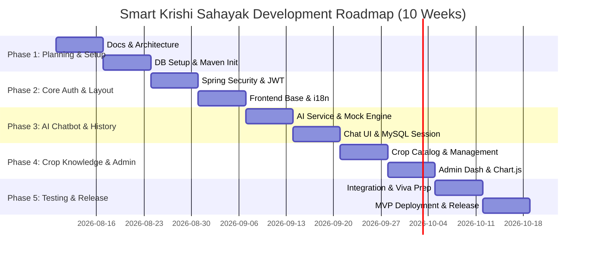

# Smart Krishi Sahayak: Master Plan & Roadmap

## 1. Project Background & Objective

### 1.1 Context
In India, smallholder farmers face significant agricultural challenges due to unpredictable climate patterns, lack of localized expert advice, language barriers, and difficulty accessing timely scientific guidance regarding crop management, pest control, and soil health.

### 1.2 Objective
**Smart Krishi Sahayak** aims to empower farmers with a multilingual, responsive, AI-enabled decision support platform. The system enables farmers to ask agricultural questions in their native language (**Marathi, Hindi, or English**) and receive accurate, practical, and safe agricultural guidance.

The project prioritizes a **Web First approach**, ensuring that all core functionalities are accessible via mobile and desktop web browsers. The backend is designed with a decoupled **RESTful API** architecture so that a **Flutter mobile app** can seamlessly connect to the same server and database in future phases.

---

## 2. Phased Development Scope

```
+-----------------------------------------------------------------------------------+
|                            PHASE A: MUST-COMPLETE MVP                              |
|  Web Landing Page | Auth (Farmer/Admin) | Multilingual UI | AI Chatbot + History   |
|  Verified Content | Admin Dashboard | Chart.js Analytics | Rest APIs + MySQL      |
+-----------------------------------------------------------------------------------+
                                         │
                                         ▼
+-----------------------------------------------------------------------------------+
|                            PHASE B: EXTENDED FEATURES                             |
|  Plant Disease Detection (Leaf Image Upload) | Weather API Integration            |
|  Soil-Health Records | Crop Recommendations | Government Schemes | Market Prices  |
+-----------------------------------------------------------------------------------+
                                         │
                                         ▼
+-----------------------------------------------------------------------------------+
|                             PHASE C: FUTURE SCOPE                                 |
|  Flutter Mobile Application | Marathi Voice Input/Output | IoT Soil Sensors       |
|  Smart Irrigation Automation | Drone Monitoring | Offline Mode                    |
+-----------------------------------------------------------------------------------+
```

### 2.1 Phase A: Must-Complete MVP (Current Focus)
1. **Responsive Web Portal:** Landing page, About, Login, Registration, Contact.
2. **User Management & Auth:** Role-based access control (`ROLE_FARMER`, `ROLE_ADMIN`) using Spring Security, BCrypt, and JWT tokens.
3. **Multilingual Architecture:** Frontend i18n support for English, Marathi (मराठी), and Hindi (हिंदी).
4. **AI Agricultural Chatbot:** Spring Boot service calling external LLM API securely; supporting mock mode for offline testing.
5. **Chat History Persistence:** Full session and message history stored in MySQL database.
6. **Crop Information Module:** Searchable and categorized repository of verified crop guidance.
7. **Admin Control Panel:** Management of crop content, monitoring of farmer chatbot queries, account controls, and system usage analytics using Chart.js.
8. **Farmer Profile:** Personal farm details, location, primary crops, and language preference management.

### 2.2 Phase B: Extended Features (Post-MVP)
1. **Leaf Disease Detection:** Image upload (JPG/PNG) analyzed by a lightweight ML prediction model.
2. **Weather Service Integration:** Real-time weather data & location-specific agricultural warnings.
3. **Smart Crop Recommendation:** Input season, soil type, and water availability to get crop suggestions.
4. **Soil Health Records:** Track soil N-P-K values and pH levels over time.
5. **Government Agriculture Schemes:** Directory of active welfare and subsidy programs for farmers.
6. **Market Prices (Mandi Bhav):** Real-time crop market rates when reliable public APIs are integrated.

### 2.3 Phase C: Future Scope
1. **Cross-Platform Flutter Mobile Application.**
2. **Marathi Voice Input & Speech Output.**
3. **IoT Soil Moisture & Temperature Sensor Nodes.**
4. **Solar & Smart Irrigation Relay Control.**
5. **Drone Aerial Health Surveys.**

---

## 3. Realistic 2–3 Month Development Roadmap (10 Weeks)



| Week | Milestone / Focus Area | Key Deliverables |
|---|---|---|
| **Week 1** | Requirement Finalization & Environment | System Architecture, Database Design, API Specs, Git Repo setup. |
| **Week 2** | Spring Boot & MySQL Foundation | Maven project setup, JPA Entities, MySQL schemas, database migrations. |
| **Week 3** | Security & User Authentication | Spring Security config, JWT service, BCrypt hashing, Registration & Login APIs. |
| **Week 4** | Web Layout & Multilingual System | Bootstrap 5 theme setup, English/Marathi/Hindi translation framework, public pages. |
| **Week 5** | AI Chatbot Backend Engine | Provider-independent `AiChatService`, fallback mock service, prompt safety filters. |
| **Week 6** | Chatbot UI & Conversation History | Interactive chat interface, AJAX Fetch integration, session history storage in MySQL. |
| **Week 7** | Crop Knowledge Base & Profiles | Verified crop database, search/filter APIs, Farmer profile management. |
| **Week 8** | Admin Portal & Analytics | Admin dashboard, query monitoring table, Chart.js user activity charts. |
| **Week 9** | End-to-End Testing & Bug Fixes | Unit tests, API security checks, responsive UI testing, cross-browser validation. |
| **Week 10** | Deployment & Project Presentation | Local/Cloud deployment, README finalization, viva presentation deck. |

---

## 4. MVP Completion Criteria (Definition of Done)

To declare Phase A (MVP) successfully completed, the following acceptance criteria must be satisfied:

1. **Authentication:** A farmer can register, log in, receive a secure JWT token, and access protected farmer endpoints. An admin can log in and access protected admin endpoints. Unauthorized access is blocked with HTTP 401/403.
2. **Multilingual Interface:** The user can switch between English, Marathi, and Hindi at any time. All UI text, navigation, forms, and AI responses switch cleanly without breaking layout.
3. **AI Chatbot Functionality:**
   - Farmer can ask agricultural questions in English, Marathi, or Hindi.
   - AI answers strictly within agricultural context and politely declines non-farm prompts.
   - System functions seamlessly both in Mock Mode (offline) and live API mode.
   - All conversation sessions and messages persist in MySQL and can be reloaded in history view.
4. **Crop Repository:** Farmers can browse and search verified crop details. Admins can add, edit, and publish crop guidance entries.
5. **Admin Operations:** Admin can view registered farmers list, toggle user active status, monitor total chatbot queries, and view graphical analytics (Chart.js).
6. **Code Quality & Architecture:** Clean separation into Controller, Service, Repository layers; DTO usage across all APIs; Global Exception Handling active; zero API keys committed to Git.
7. **Mobile Responsiveness:** All web pages render cleanly on screen widths from 360px (mobile) to 1920px (desktop).
